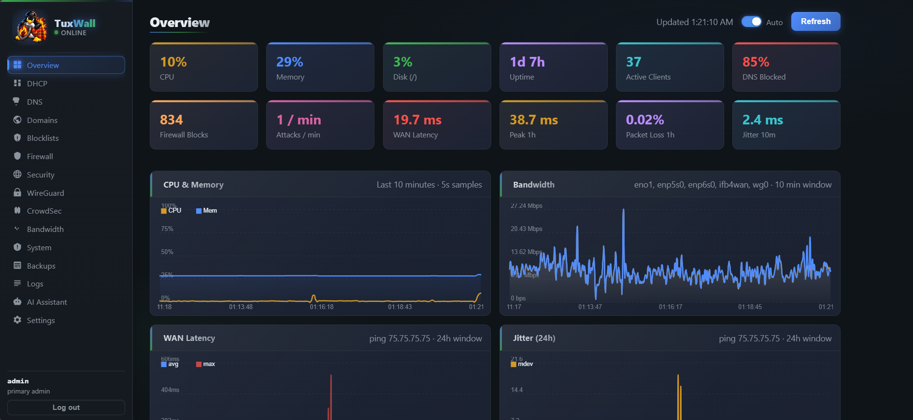
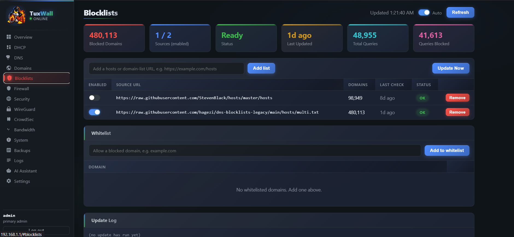
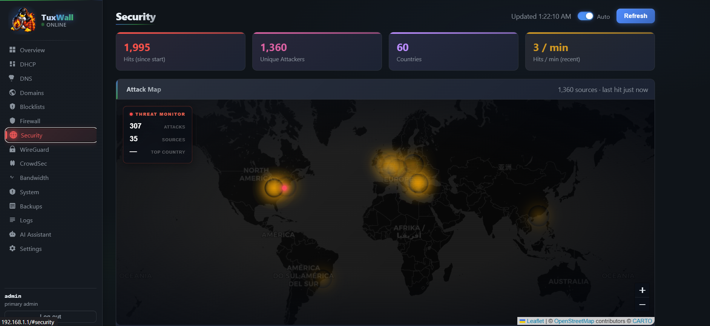
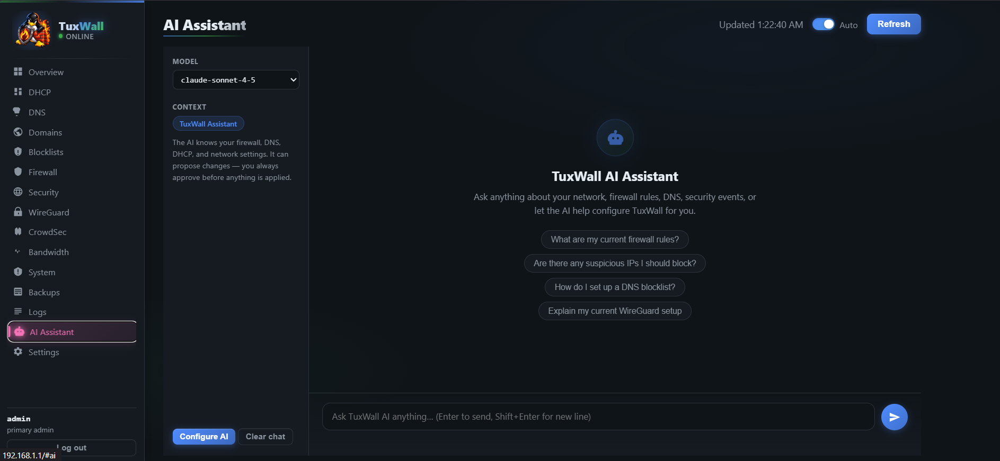
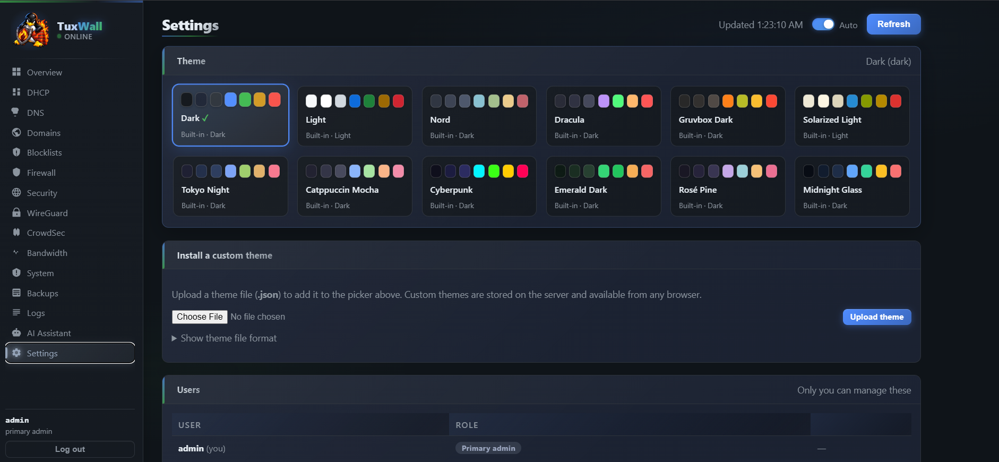

<p align="center">
  
</p>

# TuxWall

http://tuxwall.org

A Linux network dashboard providing a web UI for managing DHCP leases, DNS, firewall rules, VPN (WireGuard), and security — designed to run on a dedicated Linux gateway/router.

> **Note:** TuxWall does not work out of the box. It is a dashboard that sits on top of a carefully assembled stack of Linux networking services. Getting everything working together — especially IPv6 — requires time and patience. This README documents a known-working configuration. I have added a APT package to make installation easier. I have minimal resources to test on and every case will be different depending on your ISP, so posting my configs may not work in your use case. To support the project please share your suggestions and your support is always welcome.

[](https://www.paypal.com/ncp/payment/GY6799FZ4ZPB2)


---

## Table of Contents

- [Overview](#overview)
- [Tested Environment](#tested-environment)
- [Dependencies](#dependencies)
- [IPv6 Notes](#ipv6-notes)
- [Installation](#installation)
- [Service Configuration](#service-configuration)
- [SQM / Traffic Shaping](#sqm--traffic-shaping)
- [Nginx Configuration](#nginx-configuration)
- [Troubleshooting](#troubleshooting)
- [Contributing](#contributing)
- [License](#license)

---

## Overview

tuxwall is a web-based network dashboard that provides visibility and control over:

- **DHCP leases** (via Kea)
- **DNS filtering and local domains** (via Unbound)
- **Firewall rules** (via UFW / iptables)
- **Intrusion detection** (via Suricata + CrowdSec)
- **WireGuard VPN** management
- **IPv6 router advertisements** (via radvd)
- **SQM / traffic shaping** (via CAKE qdisc)
- **AI-assisted firewall suggestions** (optional, via LLM integration)

---

## Tested Environment

- **OS:** Ubuntu 25.04 (noble)
- **Kernel:** 6.x
- **Architecture:** x86_64
- **Role:** Dedicated gateway/router (not a desktop — a headless server connected between your modem and LAN switch)

---

## Dependencies

All of the following must be installed and working **before** tuxwall will function correctly. tuxwall is a dashboard — it reads from and controls these services but does not replace them.

### Core Networking

| Package | Version | Purpose |
|---|---|---|
| `ufw` | 0.36+ | Firewall rule management |
| `iptables` | 1.8+ | Underlying packet filtering |
| `nftables` | 1.1+ | Modern netfilter backend |
| `iproute2` | 6.x | Interface and routing management |

### DHCP

| Package | Version | Purpose |
|---|---|---|
| `kea-dhcp4-server` | 3.0+ | IPv4 DHCP server |
| `kea-common` | 3.0+ | Shared Kea libraries |

> **Note:** tuxwall reads Kea lease files directly. ISC DHCP (`isc-dhcp-server`) is **not** supported.

### DNS

| Package | Version | Purpose |
|---|---|---|
| `unbound` | 1.24+ | Recursive DNS resolver and local filtering |
| `unbound-anchor` | 1.24+ | DNSSEC trust anchor management |

> **Important:** `systemd-resolved` conflicts with unbound. Both will bind to port 53 on `127.0.0.1` and `::1`, causing DNS queries to be randomly split between them. This leads to inconsistent resolution and broken local zone lookups. You **must** disable `systemd-resolved` and point `/etc/resolv.conf` directly to unbound:
>
> ```bash
> sudo systemctl disable --now systemd-resolved
> sudo systemctl disable systemd-resolved-varlink.socket systemd-resolved-monitor.socket
> sudo rm /etc/resolv.conf
> echo -e "nameserver 127.0.0.1\nnameserver ::1\nsearch housenetwork.site" | sudo tee /etc/resolv.conf
> ```
>
> Verify no other process is on port 53:
> ```bash
> ss -ulnp | grep ':53 '
> ```
>
> Only unbound should be listening. If `systemd-resolved` reappears, check that its sockets are disabled:
> ```bash
> systemctl is-enabled systemd-resolved-varlink.socket systemd-resolved-monitor.socket
> ```

### IPv6

| Package | Version | Purpose |
|---|---|---|
| `radvd` | 2.20+ | IPv6 Router Advertisement daemon |

> **This is the most difficult part of the setup.** See [IPv6 Notes](#ipv6-notes) below.

### VPN

| Package | Version | Purpose |
|---|---|---|
| `wireguard` | 1.0+ | WireGuard kernel module |
| `wireguard-tools` | 1.0+ | `wg` and `wg-quick` CLI tools |

### Intrusion Detection / Threat Intelligence

| Package | Version | Purpose |
|---|---|---|
| `suricata` | 8.0+ | IDS/IPS — network threat detection |
| `suricata-update` | 1.3+ | Rule set updater for Suricata |
| `crowdsec` | 1.7+ | Collaborative threat intelligence agent |
| `crowdsec-firewall-bouncer-iptables` | 0.0.36+ | Applies CrowdSec bans via iptables |

### Web Server

| Package | Version | Purpose |
|---|---|---|
| `nginx` | 1.28+ | Reverse proxy serving the tuxwall dashboard |

### Runtime

| Package | Version | Purpose |
|---|---|---|
| `python3` | 3.12+ | Required to run `api_server.py` |
| `curl` | 8.x | Used by blocklist update service and GeoIP database download |
| `jq` | 1.8+ | JSON processing in scripts |
| `gzip` | 1.12+ | Decompression for blocklist and GeoIP database updates |

### Optional

| Package | Purpose |
|---|---|
| `tcpdump` | Packet capture for debugging |
| `python3-netifaces` | Enhanced network interface detection |
| `python3-maxminddb` | GeoIP lookups in the dashboard (installed by `geoip-setup.sh`) |
| `python3-pip` | Fallback installer for `maxminddb` if the deb package is unavailable |

> **Note:** Node.js and Java are **not** required by tuxwall. If you have them installed for other purposes, they will not interfere.

---

## IPv6 Notes

IPv6 was by far the hardest part of getting tuxwall working on a live internet connection. If your ISP provides native IPv6 (e.g. via DHCPv6-PD or SLAAC), you need to be extremely careful about how you configure `radvd`, `unbound`, and your kernel forwarding settings — getting any of it wrong will drop your internet connection.

**Key lessons learned:**

- **Do not disable IPv6 on the WAN interface.** Even if you don't use it internally, disabling it can break routing.
- **`radvd` must be configured to match your ISP's prefix delegation.** If your ISP hands you a `/64` or `/56`, `radvd` needs to advertise the correct subnet to your LAN.
- **Unbound needs to listen on both IPv4 and IPv6** (`interface: 0.0.0.0` and `interface: ::0`) or DNS will fail for IPv6 clients.
- **Kernel forwarding must be enabled for both IPv4 and IPv6:**
  ```bash
  sysctl -w net.ipv4.ip_forward=1
  sysctl -w net.ipv6.conf.all.forwarding=1
  ```
  Make these permanent in `/etc/sysctl.conf`.
- **UFW IPv6 support** must be enabled — set `IPV6=yes` in `/etc/default/ufw`.
- **CrowdSec and Suricata** can interfere with IPv6 traffic if not configured to allow it. Check your bouncer rules carefully.
- **WireGuard and IPv6** require explicit AllowedIPs entries for IPv6 ranges if you want VPN clients to use IPv6.
- **`systemd-networkd` and DHCPv6 clients conflict on port 546.** If both are active, they will fight over the DHCPv6 client port (`UDP 546`), causing intermittent IPv6 connectivity drops. This is extremely difficult to diagnose because IPv6 will appear to work for a while then silently fail. Check with:
  ```bash
  ss -ulnp | grep ':546 '
  ```
  If you see two processes bound to port 546, disable the one you don't need. On a dedicated gateway/router, you likely want `systemd-networkd` handling DHCPv6 — disable any standalone DHCPv6 client (e.g., `kea-dhcp6-server`, `wide-dhcpv6-client`, `dibbler-client`):
  ```bash
  sudo systemctl disable --now <dhcpv6-client-service>
  ```
  If you need `systemd-networkd` for DHCPv6, ensure its `.network` file has `DHCP=ipv6` or `DHCP=yes` on the WAN interface. If you don't need `systemd-networkd` at all, disable it:
  ```bash
  sudo systemctl disable --now systemd-networkd
  ```

If your internet drops after starting any of these services, check your IPv6 routing table first:
```bash
ip -6 route show
```

---

## Installation

### 1. Install all dependencies

```bash
sudo apt update
sudo apt install -y \
  ufw iptables nftables iproute2 \
  kea-dhcp4-server kea-common \
  unbound unbound-anchor \
  radvd \
  wireguard wireguard-tools \
  suricata suricata-update \
  crowdsec crowdsec-firewall-bouncer-iptables \
  nginx \
  python3 curl jq
```

### 2. Install tuxwall

Install the provided `.deb` package:

```bash
sudo dpkg -i tuxwall_2.2.1_all.deb
```

If you encounter dependency errors:
```bash
sudo apt -f install
sudo dpkg -i tuxwall_2.2.1_all.deb
```

### 3. Disable systemd-resolved and configure DNS

`systemd-resolved` conflicts with unbound on port 53. Disable it and point `/etc/resolv.conf` to unbound:

```bash
sudo systemctl disable --now systemd-resolved
sudo systemctl disable systemd-resolved-varlink.socket systemd-resolved-monitor.socket
sudo rm /etc/resolv.conf
echo -e "nameserver 127.0.0.1\nnameserver ::1\nsearch housenetwork.site" | sudo tee /etc/resolv.conf
```

### 4. Enable and start services

```bash
sudo systemctl enable --now kea-dhcp4-server
sudo systemctl enable --now unbound
sudo systemctl enable --now radvd
sudo systemctl enable --now suricata
sudo systemctl enable --now crowdsec
sudo systemctl enable --now nginx
sudo systemctl enable --now tuxwall
sudo systemctl enable --now tuxwall-blocklist-update.timer
```

### 5. Enable SQM (optional)

If you want CAKE-based traffic shaping, edit `scripts/tuxwall-sqm.sh` with your WAN interface and speeds, then:

```bash
sudo cp scripts/tuxwall-sqm.sh /usr/local/sbin/tuxwall-sqm.sh
sudo chmod +x /usr/local/sbin/tuxwall-sqm.sh
sudo cp systemd/tuxwall-sqm.service /etc/systemd/system/
sudo systemctl daemon-reload
sudo systemctl enable --now tuxwall-sqm
```

### 6. Enable GeoIP mapping (optional)

To show attacker locations on the Security page map, run the GeoIP setup script:

```bash
sudo bash www/scripts/geoip-setup.sh
```

This downloads the free DB-IP City Lite database and installs the `maxminddb` Python package.

---

## Service Configuration

### Nginx

Copy the nginx site config and enable it:

```bash
sudo cp nginx/tuxwall.conf /etc/nginx/sites-available/tuxwall
sudo ln -s /etc/nginx/sites-available/tuxwall /etc/nginx/sites-enabled/tuxwall
sudo nginx -t && sudo systemctl reload nginx
```

If you want the dashboard accessible by your gateway's LAN IP directly, uncomment and edit the optional `listen` directives at the top of `nginx/tuxwall.conf`.

### tuxwall config directory

```bash
sudo mkdir -p /etc/tuxwall
sudo cp config/llm.json.example /etc/tuxwall/llm.json
sudo cp config/custom-blocklist.txt /etc/tuxwall/custom-blocklist.txt
```

Edit `/etc/tuxwall/llm.json` if you want to enable the AI assistant feature (requires an OpenAI-compatible API key or a local LLM endpoint).

---

## SQM / Traffic Shaping

The `scripts/tuxwall-sqm.sh` script applies CAKE qdisc to your WAN interface for bufferbloat reduction and per-host fairness. Before using it:

1. Set `WAN` to your actual WAN interface name (find it with `ip link show`)
2. Set `UP_RATE` to ~95% of your provisioned upload speed
3. Set `DOWN_RATE` to ~92% of your provisioned download speed

Using a slightly lower percentage than your rated speed prevents your modem's queue from filling up, which is what causes bufferbloat.

---

## Troubleshooting

### Dashboard not loading

```bash
sudo systemctl status tuxwall
sudo systemctl status nginx
sudo journalctl -u tuxwall -n 50
```

### Internet drops after enabling a service

Check your IPv6 routing first — this was the most common cause:
```bash
ip -6 route show
ip route show
sudo ufw status verbose
```

Also check for port 546 conflicts between `systemd-networkd` and a DHCPv6 client — both binding to the same port causes intermittent IPv6 drops:
```bash
ss -ulnp | grep ':546 '
```
If two processes appear, disable the DHCPv6 client you don't need (see [IPv6 Notes](#ipv6-notes)).

### DNS not resolving

```bash
sudo systemctl status unbound
sudo unbound-control status
dig @127.0.0.1 google.com
```

Check if `systemd-resolved` is still running and conflicting with unbound:
```bash
systemctl is-active systemd-resolved
ss -ulnp | grep ':53 '
cat /etc/resolv.conf
```

If `systemd-resolved` is active, disable it:
```bash
sudo systemctl disable --now systemd-resolved
sudo systemctl disable systemd-resolved-varlink.socket systemd-resolved-monitor.socket
sudo rm /etc/resolv.conf
echo -e "nameserver 127.0.0.1\nnameserver ::1\nsearch housenetwork.site" | sudo tee /etc/resolv.conf
```

### DHCP leases not appearing in dashboard

Confirm Kea is running and writing its lease file:
```bash
sudo systemctl status kea-dhcp4-server
ls -lh /var/lib/kea/kea-leases4.csv
```

### CrowdSec bans blocking legitimate traffic

```bash
sudo cscli decisions list
sudo cscli decisions delete --ip <ip>
```

### WireGuard not routing traffic

```bash
sudo wg show
sudo ufw status
ip route show table main
```

### Checking all tuxwall-related services at once

```bash
systemctl status tuxwall tuxwall-sqm kea-dhcp4-server unbound radvd suricata crowdsec nginx
```

---

## Screenshots
<p align="center">
  
</p>
<p align="center">
  
</p>
<p align="center">
  
</p>
<p align="center">
  
</p>
<p align="center">
  
</p>

## Contributing

1. Fork the repository
2. Create a feature branch: `git checkout -b feature/my-feature`
3. Commit your changes: `git commit -m "Add my feature"`
4. Push to the branch: `git push origin feature/my-feature`
5. Open a Pull Request

---

## License

This project is licensed under the MIT License. See [LICENSE](LICENSE) for details.
